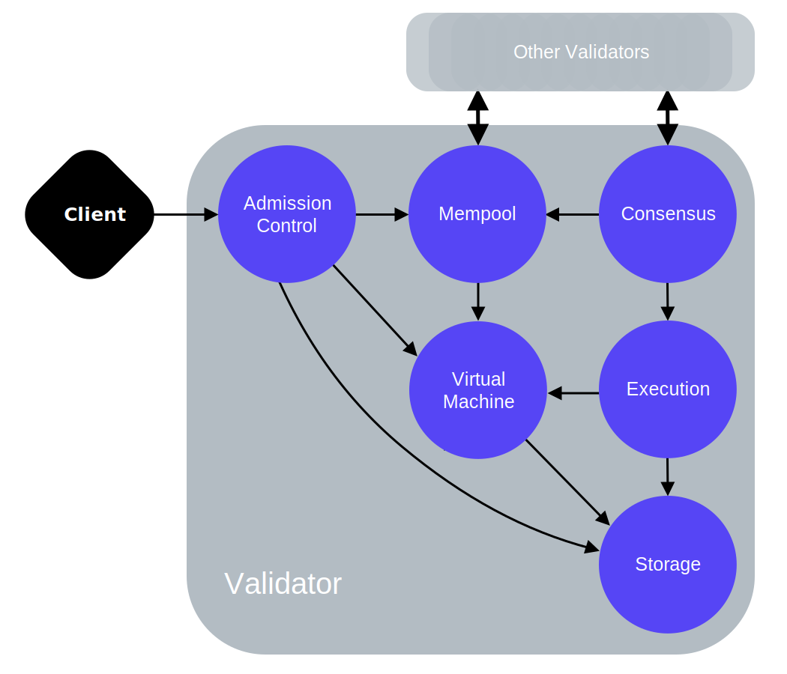

## Libra Validator Node

[TOC]

[参考文档 >>](https://developers.libra.org/docs/libra-protocol#validator-node-validator)

verify date: 2020.01.13

验证者节点负责保护 Libra 网络的安全和验证区块链上的交易。当前阶段(2020.01.13)只有 Libra 协会创始成员才能运行验证者节点。在这个初始阶段，全球范围内满足下述标准的企业、非营利组织、多边组织以及学术和研究机构均可成为创始成员。随着时间的推移，将来任何持有 Libra 货币的人都可以申请运行验证者节点和成为协会成员。


### 主要组件




Clients of the Libra Blockchain create transactions and submit them to a validator node. A validator node runs a consensus protocol (together with other validator nodes), executes the transactions, and stores the transactions and the execution results in the blockchain. Validator nodes decide which transactions will be added to the blockchain and in which order.


#### Admission Control (AC)

* Admission Control is the sole external interface of the validator node. Any request made by a client to the validator node goes to AC first.

* AC performs initial checks on the requests to protect the other parts of the validator node from corrupt or high volume input.

#### Mempool

* Mempool is a buffer that holds the transactions that are “waiting” to be executed.

* When a new transaction is added to a validator node’s mempool, this validator node’s mempool shares this transaction with the mempools of other validators in the system.

#### Consensus

* The consensus component is responsible for ordering blocks of transactions and agreeing on the results of execution by participating in the consensus protocol with other validator nodes in the network.

#### Execution

* The execution component utilizes the virtual machine (VM) to execute transactions.

* Execution’s job is to coordinate the execution of a block of transactions and maintain a transient state that can be voted upon by consensus.

* Execution maintains an in-memory representation of the results of execution until consensus commits the block to the distributed database.


#### Virtual Machine (VM)

#### Storage


### 本地环境构建 Validator Node

* 环境

```
mac 10.15.2 (19C57)
```

*  libra 工程 

```
git clone https://github.com/learn-note/learn-libra.git
cd learn-libra
git checkout learn-note-20200113
```

* 编译构建依赖的 `libra_e2e` 镜像

```
 docker/validator/build.sh
```
* 编译构建镜像 `validator`

```
docker/validator-dynamic/build-dynamic.sh 
```

* 运行验证节点

```
 docker/validator-dynamic/run.sh 
```


* 配置监控

```
https://github.com/learn-note/learn-libra/tree/learn-note-20200113/terraform/templates/dashboards
```


### Ref


* [Libra 技术设计与实现 - Westar Dev Meetup](http://westar.io/blog/meetup/libra-20200104/)


### Donate

```
BTC - 1HeHGwV2VQjnjMu5KhgCc8omQAvWskhjzt
ETH - 0xd2fe0ed0d4dfb072220570098f0e32594ba5a700
```